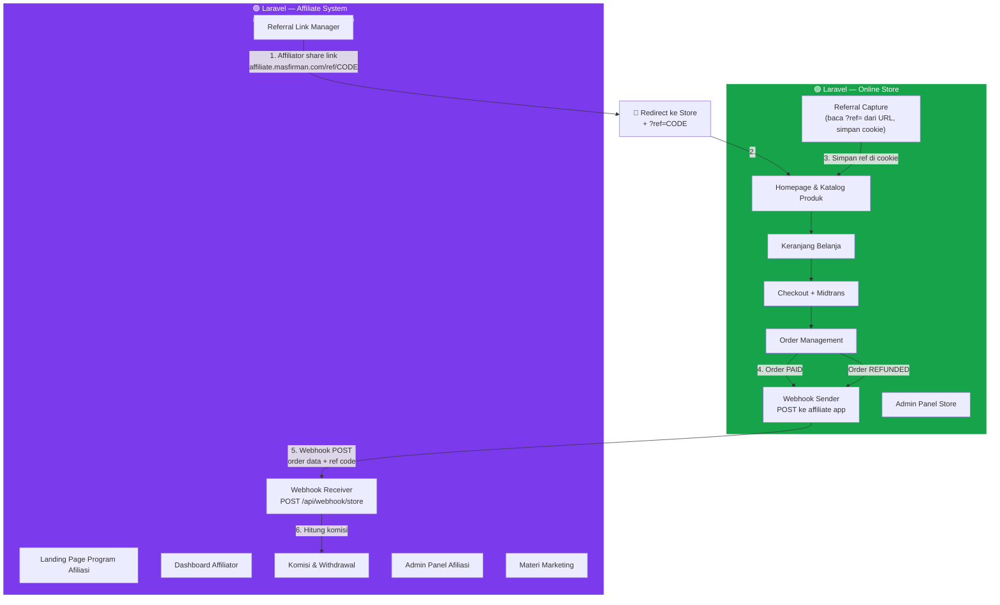
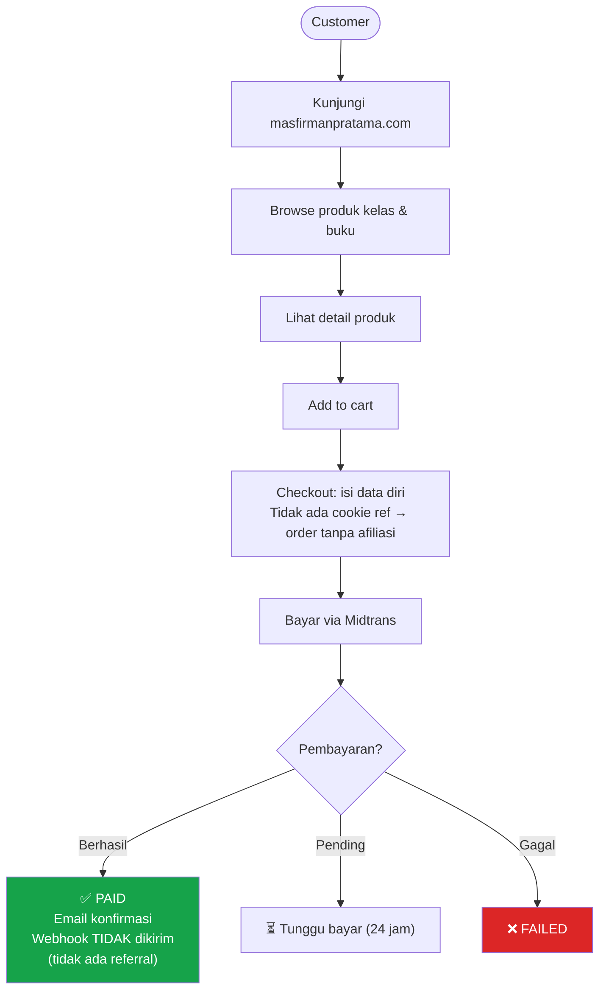
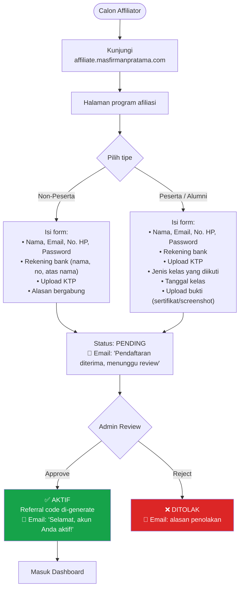
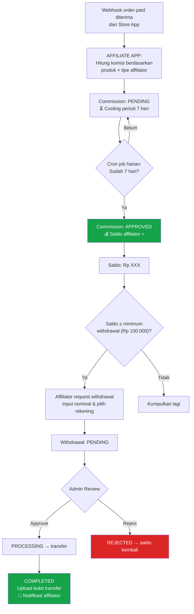
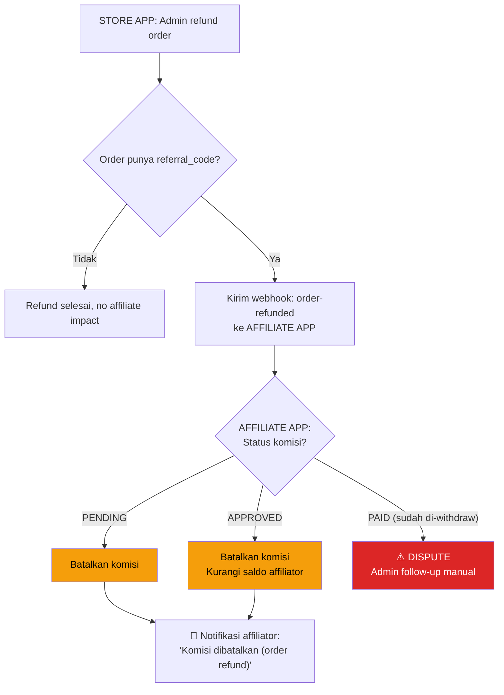
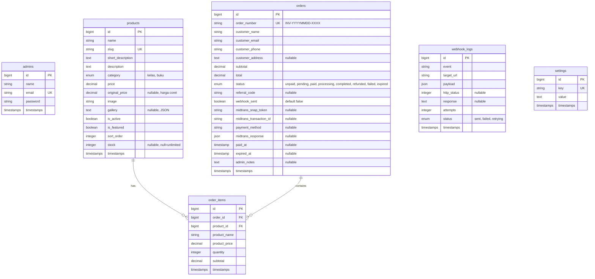
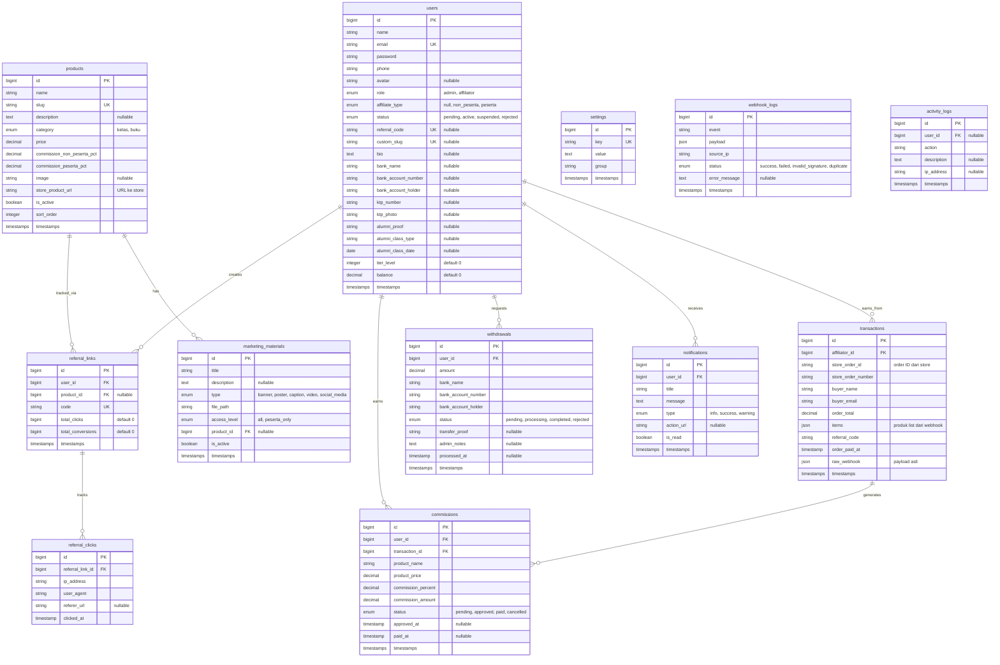

# 🚀 Online Store + Sistem Afiliasi — MasFirmanPratama.com (v4)

## Deskripsi Proyek

Membangun **dua aplikasi Laravel terpisah** yang saling terintegrasi via **webhook**:

| # | Aplikasi | Domain | Fungsi |
|---|----------|--------|--------|
| 1 | **Online Store** | `masfirmanpratama.com` | Jual beli kelas & buku, checkout, payment gateway |
| 2 | **Affiliate System** | `affiliate.masfirmanpratama.com` | Kelola affiliator, referral, komisi, withdrawal |

---

## Arsitektur Sistem (Dual Laravel + Webhook)



---

## Peran & Tanggung Jawab Masing-Masing App

### 🟢 Online Store (`masfirmanpratama.com`)

| Aspek | Detail |
|-------|--------|
| **Target user** | Pembeli (customer) & Admin Store |
| **Fitur publik** | Homepage, katalog produk, detail produk, cart, checkout |
| **Payment** | Midtrans (VA, E-Wallet, QRIS, CC) |
| **Referral capture** | Baca `?ref=CODE` dari URL → simpan di cookie 30 hari → attach ke order |
| **Webhook keluar** | Kirim data order ke affiliate app saat order paid / refunded |
| **Admin panel** | Kelola produk, kelola pesanan, lihat laporan penjualan |
| **Workspace** | `d:\laravel\store` (baru) |

### 🟣 Affiliate System (`affiliate.masfirmanpratama.com`)

| Aspek | Detail |
|-------|--------|
| **Target user** | Affiliator & Admin Afiliasi |
| **Fitur publik** | Landing page program afiliasi, register affiliator |
| **Referral link** | Generate link → redirect ke store dengan `?ref=CODE` |
| **Webhook masuk** | Terima data order dari store → hitung komisi |
| **Admin panel** | Kelola affiliator, komisi, withdrawal, marketing, settings |
| **Workspace** | `d:\laravel\affiliate` (existing) |

---

## Alur Bisnis End-to-End

### 🔄 Alur 1: Referral Tracking & Pembelian (Cross-Domain)

```mermaid
flowchart TD
    AFF([Affiliator di affiliate.masfirman.com]) --> GEN["1⃣ Buat Referral Link di Dashboard<br>affiliate.masfirmanpratama.com/ref/JOHN123<br>affiliate.masfirmanpratama.com/ref/JOHN123/kelas-reguler"]
    GEN --> SHARE["2⃣ Share link via<br>WhatsApp / IG / FB / TikTok"]
    
    SHARE --> CLICK["3⃣ Calon pembeli klik link"]
    
    CLICK --> AFF_APP["4⃣ AFFILIATE APP menerima request:<br>• Catat klik di DB (IP, user-agent, waktu)<br>• Increment counter referral_link"]
    
    AFF_APP --> REDIRECT["5⃣ Redirect 302 ke STORE APP:<br>masfirmanpratama.com/product/kelas-reguler?ref=JOHN123"]
    
    REDIRECT --> STORE_APP["6⃣ STORE APP menerima request:<br>• Baca ?ref=JOHN123 dari URL<br>• Set cookie 'aff_ref=JOHN123' (30 hari)<br>• Tampilkan halaman produk"]
    
    STORE_APP --> BROWSE["7⃣ Customer browsing produk<br>(cookie ref tetap tersimpan<br>meskipun pindah halaman)"]
    
    BROWSE --> CART["8⃣ Customer add to cart"]
    CART --> CHECKOUT["9⃣ Checkout:<br>• Isi data diri (nama, email, HP, alamat)<br>• Sistem baca cookie aff_ref=JOHN123<br>• Simpan referral_code di order"]
    
    CHECKOUT --> PAY["🔟 Bayar via Midtrans<br>(VA / E-Wallet / QRIS)"]
    
    PAY --> MIDTRANS_CB["1⃣1⃣ Midtrans callback ke STORE APP:<br>Status: settlement (berhasil)"]
    
    MIDTRANS_CB --> ORDER_PAID["1⃣2⃣ STORE APP update order → PAID<br>• Kirim email konfirmasi ke customer"]
    
    ORDER_PAID --> WEBHOOK["1⃣3⃣ STORE APP kirim Webhook POST ke AFFILIATE APP:<br>POST affiliate.masfirmanpratama.com/api/webhook/store/order-paid"]
    
    WEBHOOK --> AFF_PROCESS["1⃣4⃣ AFFILIATE APP proses webhook:<br>• Validasi HMAC signature<br>• Cari affiliator dari ref code 'JOHN123'<br>• Cari produk di DB affiliate<br>• Hitung komisi: harga × persentase<br>• Buat record Commission (PENDING)<br>• Kirim notifikasi ke affiliator"]

    style ORDER_PAID fill:#16a34a,color:#fff
    style AFF_APP fill:#7c3aed,color:#fff
    style AFF_PROCESS fill:#7c3aed,color:#fff
    style STORE_APP fill:#16a34a,color:#fff
```



---

### 🔄 Alur 2: Customer Membeli Tanpa Referral



> [!NOTE]
> Webhook ke affiliate app **hanya dikirim jika order memiliki `referral_code`**. Order tanpa referral tidak mempengaruhi affiliate system sama sekali.

---

### 🔄 Alur 3: Pendaftaran Affiliator



---

### 🔄 Alur 4: Komisi & Withdrawal



---

### 🔄 Alur 5: Refund & Pembatalan



---

## Webhook Specification

### Dari Store → Affiliate

Semua webhook menggunakan **HMAC-SHA256** signature untuk keamanan.

#### Webhook: `order-paid`
```
POST https://affiliate.masfirmanpratama.com/api/webhook/store/order-paid
Headers:
  Content-Type: application/json
  X-Webhook-Signature: {hmac_sha256(payload, shared_secret)}
  X-Webhook-Timestamp: {unix_timestamp}

Body:
{
    "event": "order.paid",
    "order_id": 12345,
    "order_number": "INV-20260409-0001",
    "referral_code": "JOHN123",
    "customer": {
        "name": "Budi Santoso",
        "email": "budi@email.com",
        "phone": "081234567890"
    },
    "items": [
        {
            "product_slug": "kelas-reguler-amc",
            "product_name": "Kelas Reguler AMC",
            "price": 4500000,
            "quantity": 1,
            "subtotal": 4500000
        }
    ],
    "total": 4500000,
    "paid_at": "2026-04-09T12:00:00+07:00"
}
```

#### Webhook: `order-refunded`
```
POST https://affiliate.masfirmanpratama.com/api/webhook/store/order-refunded
Headers:
  Content-Type: application/json
  X-Webhook-Signature: {hmac_sha256(payload, shared_secret)}

Body:
{
    "event": "order.refunded",
    "order_id": 12345,
    "order_number": "INV-20260409-0001",
    "referral_code": "JOHN123",
    "refund_amount": 4500000,
    "refunded_at": "2026-04-12T15:00:00+07:00"
}
```

### Dari Affiliate → Store (Opsional)

#### API: Validasi Referral Code
```
GET https://affiliate.masfirmanpratama.com/api/validate-ref/{code}
Response: { "valid": true, "affiliator_name": "John Doe" }
```
Store app bisa memanggil ini saat customer checkout untuk menampilkan info "Direferensikan oleh: John Doe".

---

## Fitur Detail

### 📦 A. Online Store (masfirmanpratama.com)

#### Homepage Store
- Hero section: branding Mas Firman Pratama, tagline, CTA
- Produk unggulan (featured products)
- Benefit ikut kelas AMC
- Testimoni peserta
- Artikel terbaru (opsional)
- Footer: kontak, sosmed, link ke program afiliasi

#### Katalog & Detail Produk
- Grid/list view produk, filter kategori (kelas/buku)
- Detail produk: gambar, deskripsi lengkap, harga, benefit, CTA beli
- Kelas: tampilkan jadwal, materi 20 poin AMC, benefit, testimoni
- Buku: deskripsi, preview/teaser, harga

#### Cart & Checkout
- Session-based cart (tanpa login)
- Checkout: nama, email, HP, alamat (buku fisik)
- **Guest checkout** — tidak perlu daftar akun
- Recap order sebelum bayar
- Midtrans Snap payment page
- Halaman sukses & gagal
- Email invoice/konfirmasi otomatis

#### Admin Panel Store
- Dashboard: total penjualan, revenue, order hari ini
- CRUD produk (kelas & buku)
- Kelola pesanan (list, detail, update status, refund)
- Laporan penjualan (filter tanggal, produk, status)
- Pengaturan: info toko, Midtrans keys, webhook secret

### Katalog Produk

| Kategori | Produk | Harga |
|----------|--------|-------|
| Kelas | Kelas Reguler AMC | Rp 4.500.000 |
| Kelas | Kelas Privat AMC | Rp 7.500.000 |
| Kelas | Kelas Platinum AMC | Rp 22.500.000 |
| Buku | Buku Alpha Telepati | TBD |
| Buku | Kitab KPR (Kunci Penarik Rezeki) | TBD |
| Buku | Buku 10 Keajaiban Pikiran | TBD |
| Buku | Kitab 101 Kalimat Sugesti Ajaib | TBD |
| Buku | Buku Instan Hipnotis | TBD |

---

### 🤝 B. Affiliate System (affiliate.masfirmanpratama.com)

#### Dua Tipe Affiliator

| Aspek | Non-Peserta | Peserta (Alumni) |
|-------|-------------|------------------|
| Syarat | Belum pernah ikut kelas AMC | Pernah ikut kelas (diverifikasi) |
| Komisi kelas | 5% | 10% |
| Komisi buku | 10% | 15% |
| Custom slug | ❌ | ✅ `/ref/{custom}` |
| QR Code | ❌ | ✅ |
| Materi marketing | Dasar | Semua + eksklusif |
| Export data | ❌ | ✅ CSV/Excel |
| Leaderboard | Lihat saja | Ikut peringkat |
| Dashboard | Standar | Lengkap + breakdown |
| Badge | - | ✅ "Verified Alumni" |

> [!WARNING]
> Persentase komisi adalah **saran**. Admin bisa ubah per produk kapan saja.

#### Tier & Gamification

| Tier | Total Penjualan | Bonus Komisi |
|------|----------------|--------------|
| 🥉 Bronze | 0 – 5 | - |
| 🥈 Silver | 6 – 20 | +1% |
| 🥇 Gold | 21 – 50 | +2% |
| 💎 Diamond | 51+ | +3% |

---

#### Landing Page Program Afiliasi
```
┌──────────────────────────────────────────────────────────┐
│  🧠 HERO                                                 │
│  "Hasilkan Jutaan Rupiah dengan Mempromosikan            │
│   Produk Mas Firman Pratama"                             │
│  [Daftar Sekarang]  [Login]                              │
├──────────────────────────────────────────────────────────┤
│  ✨ KENAPA BERGABUNG?                                     │
│  💰 Komisi sd 10%+   📊 Dashboard real-time              │
│  🔗 Link unik        📱 Materi marketing siap pakai      │
│  💳 Withdrawal mudah  🏆 Leaderboard & bonus              │
├──────────────────────────────────────────────────────────┤
│  ⚖️ PERBANDINGAN AFFILIATOR                              │
│  ┌──────────────────┐  ┌──────────────────┐             │
│  │  NON-PESERTA     │  │  PESERTA/ALUMNI  │             │
│  │  Komisi sd 5-10% │  │  Komisi sd 10-15%│             │
│  │  Dashboard std   │  │  Dashboard pro   │             │
│  │  Materi dasar    │  │  Semua materi    │             │
│  │  [Daftar]        │  │  [Daftar]        │             │
│  └──────────────────┘  └──────────────────┘             │
├──────────────────────────────────────────────────────────┤
│  📦 PRODUK YANG BISA DIPROMOSIKAN                        │
│  • Kelas Reguler Rp 4.5jt                               │
│  • Kelas Privat Rp 7.5jt                                │
│  • Kelas Platinum Rp 22.5jt                             │
│  • 5 Buku panduan                                        │
├──────────────────────────────────────────────────────────┤
│  📌 CARA KERJA                                           │
│  1 Daftar → 2 Dapat Link → 3 Share → 4 Dapat Komisi    │
├──────────────────────────────────────────────────────────┤
│  💬 TESTIMONI AFFILIATOR SUKSES                          │
├──────────────────────────────────────────────────────────┤
│  ❓ FAQ                                                  │
├──────────────────────────────────────────────────────────┤
│  🚀 CTA: "Gabung Sekarang — GRATIS!" [Daftar]          │
└──────────────────────────────────────────────────────────┘
```

#### Dashboard Non-Peserta
- **Banner** upgrade ke Peserta
- 4 stat cards: Klik, Penjualan, Konversi (%), Saldo
- Grafik trend 30 hari (line chart)
- Daftar referral link + copy button
- Tabel transaksi/komisi terakhir
- Widget withdrawal (saldo + tombol tarik)

#### Dashboard Peserta (Alumni)
- **Badge** "✅ Verified Alumni" + current tier
- 5 stat cards: Klik, Penjualan, Konversi, Saldo, Total Earned
- Grafik trend + pie chart breakdown per produk
- Referral link + **custom slug** + **QR Code**
- Materi marketing (termasuk **eksklusif alumni**)
- **Leaderboard** posisi bulan ini
- Tabel komisi + withdrawal history
- Export data (CSV/Excel)

---

### 🔗 C. Referral Link System

| Fitur | Non-Peserta | Peserta |
|-------|-------------|---------|
| Link umum | ✅ `affiliate.masfirman.com/ref/{code}` | ✅ |
| Link per produk | ✅ `affiliate.masfirman.com/ref/{code}/{slug}` | ✅ |
| Custom slug | ❌ | ✅ `affiliate.masfirman.com/ref/{custom}` |
| QR Code | ❌ | ✅ Generate & download |
| Copy 1-klik | ✅ | ✅ |
| Statistik per link | ✅ (klik & konversi) | ✅ (detail breakdown) |

**Mekanisme tracking:**
```
AFFILIATE APP                           STORE APP
─────────────                           ─────────────
1. Affiliator buat link
   /ref/JOHN123/kelas-reguler
                        ─── customer klik ───►
2. Catat klik (IP, UA, time)
3. Redirect 302 ──────────────────────► 4. Terima request
                                           ?ref=JOHN123
                                        5. Set cookie aff_ref=JOHN123
                                           (30 hari)
                                        6. Tampilkan halaman produk
                                        
                                        ... customer browsing ...
                                        
                                        7. Checkout: baca cookie
                                           → order.referral_code = JOHN123
                                        8. Bayar via Midtrans
                                        9. Midtrans callback → PAID
                                        10. Kirim webhook ke AFFILIATE APP
                        ◄── webhook ────
11. Terima webhook
12. Validasi signature
13. Cari affiliator JOHN123
14. Hitung komisi
15. Buat Commission (PENDING)
16. Notifikasi affiliator
```

---

## Database Schemas

### 🟢 Database: Store App (`store_db`)



---

### 🟣 Database: Affiliate App (`affiliate_db`)



---

## Route Structures

### 🟢 Store App Routes (`d:\laravel\store\routes\web.php`)

```php
// PUBLIC — Store
Route::get('/', [HomeController::class, 'index'])->name('home');
Route::get('/products', [ProductController::class, 'index'])->name('products.index');
Route::get('/products/{slug}', [ProductController::class, 'show'])->name('products.show');

// Cart & Checkout
Route::get('/cart', [CartController::class, 'index'])->name('cart.index');
Route::post('/cart/add', [CartController::class, 'add'])->name('cart.add');
Route::put('/cart/update', [CartController::class, 'update'])->name('cart.update');
Route::delete('/cart/remove/{id}', [CartController::class, 'remove'])->name('cart.remove');
Route::get('/checkout', [CheckoutController::class, 'index'])->name('checkout.index');
Route::post('/checkout', [CheckoutController::class, 'process'])->name('checkout.process');
Route::get('/checkout/success/{orderNumber}', [CheckoutController::class, 'success'])->name('checkout.success');
Route::get('/checkout/pending', [CheckoutController::class, 'pending'])->name('checkout.pending');

// Order tracking (tanpa login)
Route::get('/order/{orderNumber}', [OrderTrackingController::class, 'show'])->name('order.track');

// Midtrans Notification (API)
Route::post('/api/midtrans/notification', [MidtransCallbackController::class, 'handle']);

// ADMIN — Store
Route::middleware(['auth', 'admin'])->prefix('admin')->name('admin.')->group(function () {
    Route::get('/dashboard', [Admin\DashboardController::class, 'index'])->name('dashboard');
    Route::resource('products', Admin\ProductController::class);
    Route::get('/orders', [Admin\OrderController::class, 'index'])->name('orders.index');
    Route::get('/orders/{id}', [Admin\OrderController::class, 'show'])->name('orders.show');
    Route::post('/orders/{id}/update-status', [Admin\OrderController::class, 'updateStatus']);
    Route::post('/orders/{id}/refund', [Admin\OrderController::class, 'refund']);
    Route::get('/settings', [Admin\SettingController::class, 'index'])->name('settings');
    Route::post('/settings', [Admin\SettingController::class, 'update']);
});

// Auth — Admin Store only
Route::get('/admin/login', [Admin\AuthController::class, 'showLogin'])->name('admin.login');
Route::post('/admin/login', [Admin\AuthController::class, 'login']);
Route::post('/admin/logout', [Admin\AuthController::class, 'logout'])->name('admin.logout');
```

### 🟣 Affiliate App Routes (`d:\laravel\affiliate\routes\web.php`)

```php
// PUBLIC — Landing page afiliasi
Route::get('/', [HomeController::class, 'index'])->name('home');

// Referral tracking
Route::get('/ref/{code}', [ReferralController::class, 'track'])->name('ref.track');
Route::get('/ref/{code}/{productSlug}', [ReferralController::class, 'trackProduct'])->name('ref.track.product');

// Webhook dari Store (API)
Route::prefix('api/webhook/store')->group(function () {
    Route::post('/order-paid', [WebhookController::class, 'orderPaid']);
    Route::post('/order-refunded', [WebhookController::class, 'orderRefunded']);
});

// Validate referral API (dipanggil oleh Store)
Route::get('/api/validate-ref/{code}', [ReferralController::class, 'validate']);

// Auth
Route::middleware('guest')->group(function () {
    Route::get('/login', [AuthController::class, 'showLogin'])->name('login');
    Route::post('/login', [AuthController::class, 'login']);
    Route::get('/register', [AuthController::class, 'showRegister'])->name('register');
    Route::post('/register', [AuthController::class, 'register']);
});
Route::post('/logout', [AuthController::class, 'logout'])->name('logout');

// ADMIN — Affiliate
Route::middleware(['auth', 'role:admin'])->prefix('admin')->name('admin.')->group(function () {
    Route::get('/dashboard', [Admin\DashboardController::class, 'index'])->name('dashboard');
    Route::get('/affiliators', [Admin\AffiliatorController::class, 'index'])->name('affiliators.index');
    Route::get('/affiliators/{id}', [Admin\AffiliatorController::class, 'show'])->name('affiliators.show');
    Route::post('/affiliators/{id}/approve', [Admin\AffiliatorController::class, 'approve']);
    Route::post('/affiliators/{id}/reject', [Admin\AffiliatorController::class, 'reject']);
    Route::post('/affiliators/{id}/suspend', [Admin\AffiliatorController::class, 'suspend']);
    Route::post('/affiliators/{id}/change-type', [Admin\AffiliatorController::class, 'changeType']);
    Route::resource('products', Admin\ProductController::class);
    Route::get('/commissions', [Admin\CommissionController::class, 'index'])->name('commissions.index');
    Route::post('/commissions/{id}/approve', [Admin\CommissionController::class, 'approve']);
    Route::post('/commissions/{id}/cancel', [Admin\CommissionController::class, 'cancel']);
    Route::get('/withdrawals', [Admin\WithdrawalController::class, 'index'])->name('withdrawals.index');
    Route::post('/withdrawals/{id}/process', [Admin\WithdrawalController::class, 'process']);
    Route::post('/withdrawals/{id}/complete', [Admin\WithdrawalController::class, 'complete']);
    Route::post('/withdrawals/{id}/reject', [Admin\WithdrawalController::class, 'reject']);
    Route::resource('marketing', Admin\MarketingMaterialController::class);
    Route::get('/leaderboard', [Admin\LeaderboardController::class, 'index'])->name('leaderboard');
    Route::get('/webhook-logs', [Admin\WebhookLogController::class, 'index'])->name('webhook-logs');
    Route::get('/settings', [Admin\SettingController::class, 'index'])->name('settings');
    Route::post('/settings', [Admin\SettingController::class, 'update']);
});

// AFFILIATOR
Route::middleware(['auth', 'role:affiliator', 'affiliate.active'])->prefix('affiliator')->name('affiliator.')->group(function () {
    Route::get('/dashboard', [Affiliator\DashboardController::class, 'index'])->name('dashboard');
    Route::get('/links', [Affiliator\LinkController::class, 'index'])->name('links.index');
    Route::post('/links', [Affiliator\LinkController::class, 'store'])->name('links.store');
    Route::delete('/links/{id}', [Affiliator\LinkController::class, 'destroy'])->name('links.destroy');
    Route::get('/links/{id}/qr', [Affiliator\LinkController::class, 'qrCode'])->name('links.qr');
    Route::get('/commissions', [Affiliator\CommissionController::class, 'index'])->name('commissions.index');
    Route::get('/withdrawals', [Affiliator\WithdrawalController::class, 'index'])->name('withdrawals.index');
    Route::post('/withdrawals', [Affiliator\WithdrawalController::class, 'store'])->name('withdrawals.store');
    Route::get('/marketing', [Affiliator\MarketingController::class, 'index'])->name('marketing.index');
    Route::get('/marketing/{id}/download', [Affiliator\MarketingController::class, 'download']);
    Route::get('/leaderboard', [Affiliator\LeaderboardController::class, 'index'])->name('leaderboard');
    Route::get('/profile', [Affiliator\ProfileController::class, 'edit'])->name('profile.edit');
    Route::put('/profile', [Affiliator\ProfileController::class, 'update'])->name('profile.update');
    Route::get('/notifications', [Affiliator\NotificationController::class, 'index'])->name('notifications.index');
    Route::post('/notifications/{id}/read', [Affiliator\NotificationController::class, 'markRead']);
    Route::post('/notifications/read-all', [Affiliator\NotificationController::class, 'markAllRead']);
});
```

---

## File Structures

### 🟢 Store App (`d:\laravel\store`)

```
d:\laravel\store\
├── app/
│   ├── Http/Controllers/
│   │   ├── HomeController.php
│   │   ├── ProductController.php
│   │   ├── CartController.php
│   │   ├── CheckoutController.php
│   │   ├── MidtransCallbackController.php
│   │   ├── OrderTrackingController.php
│   │   └── Admin/
│   │       ├── AuthController.php
│   │       ├── DashboardController.php
│   │       ├── ProductController.php
│   │       ├── OrderController.php
│   │       └── SettingController.php
│   ├── Http/Middleware/
│   │   └── AdminMiddleware.php
│   ├── Http/Requests/
│   │   ├── CheckoutRequest.php
│   │   └── StoreProductRequest.php
│   ├── Models/
│   │   ├── Admin.php
│   │   ├── Product.php
│   │   ├── Order.php
│   │   ├── OrderItem.php
│   │   ├── WebhookLog.php
│   │   └── Setting.php
│   ├── Services/
│   │   ├── CartService.php
│   │   ├── OrderService.php
│   │   ├── MidtransService.php
│   │   └── WebhookSenderService.php
│   ├── Observers/
│   │   └── OrderObserver.php
│   └── Console/Commands/
│       └── ExpireUnpaidOrders.php
├── database/migrations/ (6 migrations)
├── database/seeders/
│   ├── AdminSeeder.php
│   ├── ProductSeeder.php
│   └── SettingSeeder.php
├── resources/views/
│   ├── layouts/
│   │   ├── store.blade.php
│   │   └── admin.blade.php
│   ├── store/ (home, products, cart, checkout, success)
│   ├── admin/ (dashboard, products, orders, settings)
│   └── emails/ (order-confirmation, order-paid)
├── public/css/store.css
├── public/js/store.js
├── routes/ (web.php, api.php)
└── config/midtrans.php
```

### 🟣 Affiliate App (`d:\laravel\affiliate`)

```
d:\laravel\affiliate\
├── app/
│   ├── Http/Controllers/
│   │   ├── HomeController.php
│   │   ├── ReferralController.php
│   │   ├── WebhookController.php
│   │   ├── AuthController.php
│   │   ├── Admin/
│   │   │   ├── DashboardController.php
│   │   │   ├── AffiliatorController.php
│   │   │   ├── ProductController.php
│   │   │   ├── CommissionController.php
│   │   │   ├── WithdrawalController.php
│   │   │   ├── MarketingMaterialController.php
│   │   │   ├── LeaderboardController.php
│   │   │   ├── WebhookLogController.php
│   │   │   └── SettingController.php
│   │   └── Affiliator/
│   │       ├── DashboardController.php
│   │       ├── LinkController.php
│   │       ├── CommissionController.php
│   │       ├── WithdrawalController.php
│   │       ├── MarketingController.php
│   │       ├── LeaderboardController.php
│   │       ├── ProfileController.php
│   │       └── NotificationController.php
│   ├── Http/Middleware/
│   │   ├── RoleMiddleware.php
│   │   ├── AffiliateActiveMiddleware.php
│   │   └── VerifyWebhookSignature.php
│   ├── Http/Requests/
│   │   ├── RegisterAffiliatorRequest.php
│   │   ├── WithdrawalRequest.php
│   │   └── UpdateProfileRequest.php
│   ├── Models/
│   │   ├── User.php
│   │   ├── Product.php
│   │   ├── ReferralLink.php
│   │   ├── ReferralClick.php
│   │   ├── Transaction.php
│   │   ├── Commission.php
│   │   ├── Withdrawal.php
│   │   ├── MarketingMaterial.php
│   │   ├── Notification.php
│   │   ├── Setting.php
│   │   ├── WebhookLog.php
│   │   └── ActivityLog.php
│   ├── Services/
│   │   ├── ReferralService.php
│   │   ├── CommissionService.php
│   │   ├── WebhookService.php
│   │   ├── WithdrawalService.php
│   │   └── NotificationService.php
│   └── Console/Commands/
│       ├── AutoApproveCommissions.php
│       └── CalculateLeaderboard.php
├── database/migrations/ (12 migrations)
├── database/seeders/
│   ├── AdminSeeder.php
│   ├── ProductSeeder.php
│   └── SettingSeeder.php
├── resources/views/
│   ├── layouts/ (app, admin, affiliator, auth)
│   ├── home/ (landing page program afiliasi)
│   ├── auth/ (login, register)
│   ├── admin/ (dashboard, affiliators, products, commissions, withdrawals, marketing, leaderboard, webhook-logs, settings)
│   ├── affiliator/ (dashboard, links, commissions, withdrawals, marketing, leaderboard, profile, notifications)
│   └── emails/ (approved, rejected, commission-earned, withdrawal-completed)
├── public/css/affiliate.css
├── public/js/affiliate.js
└── routes/ (web.php, api.php)
```

---

## User Review Required

> [!IMPORTANT]
> ### Hal yang Perlu Dikonfirmasi:
> 1. **Harga buku** — Berapa harga masing-masing buku?
> 2. **Persentase komisi** — 5%/10% kelas, 10%/15% buku sudah ok?
> 3. **Minimum withdrawal** — Rp 100.000?
> 4. **Payment gateway** — Saya usulkan **Midtrans**. Sudah punya akun?
> 5. **Guest checkout** — Pembeli beli tanpa daftar akun? (rekomendasi: ✅)
> 6. **Buku fisik/digital?** — Perlu integrasi ongkir?
> 7. **Store app workspace** — Apakah `d:\laravel\store` ok untuk project Store?
> 8. **Apakah kedua admin panel** (Store & Affiliate) diakses oleh orang/akun yang **sama**?
> 9. **Logo** — `logo.jpg` yang ada di workspace, apakah itu yang dipakai?

---

## Open Questions

1. **Kelas AMC** — Setelah bayar, proses selanjutnya apa? (admin hubungi via WA? dapat link Zoom? email jadwal?)
2. **Existing data** — Ada data peserta/customer lama yang perlu di-import?
3. **Branding/warna** — Ada guideline khusus selain dari website utama?
4. **Multi-level/downline** — Tidak ada di v1. Setuju?
5. **Approval affiliator** — Semua harus approve admin, atau non-peserta bisa langsung aktif?

---

## Verification Plan

### Automated Tests
```bash
# Store App
cd d:\laravel\store && php artisan test && php artisan migrate:fresh --seed

# Affiliate App
cd d:\laravel\affiliate && php artisan test && php artisan migrate:fresh --seed
```

### End-to-End Test
1. **Store**: Browse → Cart → Checkout → Midtrans → Order Paid
2. **Referral**: Klik ref link di affiliate → redirect ke store → beli → webhook → komisi
3. **Affiliate**: Register → Approve → Buat link → Share → Dapat komisi → Withdraw
4. **Refund**: Admin refund di store → webhook → komisi dibatalkan di affiliate
5. **Responsive**: Mobile, tablet, desktop (kedua app)
6. **Security**: Webhook signature, self-referral detection, rate limiting

---

## Estimasi Fase Development

| Fase | App | Deskripsi |
|------|-----|-----------|
| **1** | Store | Setup Laravel, DB, Migrations, Seeders, Auth Admin |
| **2** | Store | Homepage, Katalog Produk, Detail Produk |
| **3** | Store | Cart, Checkout, Midtrans Integration |
| **4** | Store | Admin Panel (Dashboard, CRUD Produk, Kelola Order) |
| **5** | Store | Referral Capture (cookie) + Webhook Sender |
| **6** | Affiliate | Setup Laravel, DB, Migrations, Seeders, Auth |
| **7** | Affiliate | Landing Page Program Afiliasi + Registrasi |
| **8** | Affiliate | Admin Panel (Dashboard, Affiliator, Produk, Komisi) |
| **9** | Affiliate | Affiliator Dashboard (Non-Peserta & Peserta) |
| **10** | Affiliate | Referral Links, Click Tracking, Redirect |
| **11** | Affiliate | Webhook Receiver + Commission Calculation |
| **12** | Affiliate | Withdrawal, Marketing, Leaderboard |
| **13** | Both | Notifikasi (Email + In-App) |
| **14** | Both | Polish, Responsive, Testing, Bug Fixes |
